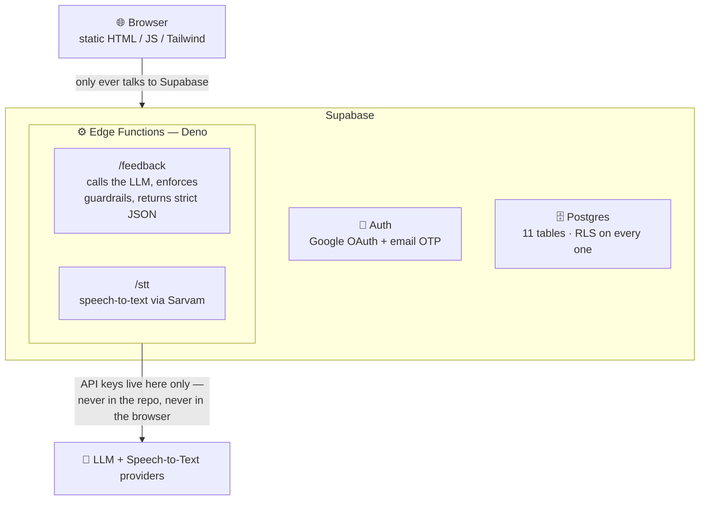

<div align="center">

# ByoU — an AI speaking coach for people who freeze up in English

### Practise speaking English for 5 minutes a day. Private, gentle, never harsh.

[**🎙️ Try the live app →**](https://bey-u.vercel.app/)

*Built solo, end to end — from prompt to production.*

</div>

---

## Why this exists

Millions of people in India can **read and write** English perfectly well but freeze the moment they have to **speak** — in an interview, on a call, in a room full of strangers. The blocker isn't grammar. It's the fear of being corrected.

ByoU is a mobile-first web app that removes that fear. You get a question, you speak your answer, and an AI coach replies with **one thing you did well and one small upgrade** — framed as encouragement, never criticism. Do it for five minutes, build a streak, come back tomorrow.

The entire product is designed around a single metric: *did the learner want to speak again the next day?*

> I designed, built, and shipped this on my own — product thinking, curriculum, UX, database, AI pipeline, guardrails, evals, and deployment.

---

## What it does

- 📅 **28+ days of structured curriculum** across three tracks — Interview Prep, Everyday Conversation, and a combined bundle — organised into weekly themes (introducing yourself, talking about your work, the classic questions, staying calm under pressure).
- 🗣️ **Speak or type your answer.** Voice is transcribed; typed answers are treated as the real answer, never as failed speech.
- ⚡ **AI feedback in seconds** — specific praise quoting the learner's own words, one concrete upgrade, and a natural rewrite of what they could have said, plus a short line to say aloud right away.
- 📚 **A ~4,000-word vocabulary system** with daily flashcards drawn from interview, academic, and daily-life word lists.
- 🔥 **Streaks, points, and a gentle daily digest** to build the habit without pressure.
- 🔐 **Google & email sign-in**, per-user progress, and privacy by default.

---

## How it's built

ByoU is deliberately a **no-build, plain-HTML frontend talking to a Supabase backend**, with all AI and secrets isolated in Edge Functions. That was a design decision, not a limitation: it keeps the browser dumb, makes the security model trivial to reason about, and means the whole thing deploys as static files.



### The stack

| Layer | Choice | Why |
|---|---|---|
| **Frontend** | Vanilla JS (ES modules) + Tailwind CSS | No build step to break; ships as static files |
| **Backend** | Supabase (Postgres + Auth) | Auth, database, and RLS in one place |
| **AI / secrets** | Supabase Edge Functions (Deno) | Keeps every API key out of the client |
| **Speech-to-text** | Sarvam (`saarika:v2.5`, `en-IN`) | Tuned for Indian English accents |
| **Hosting** | Vercel | Static deploy, instant rollbacks |
| **Analytics** | Google Analytics 4 + first-party `events` table | Product funnel visibility from day one |

### Data model (11 tables)

`profiles` · `courses` · `course_days` · `questions` · `sessions` · `answers` · `words` · `user_words` · `daily_progress` · `user_feedback` · `events`

Every table has **Row-Level Security** enabled — a user can only ever read or write their own rows. A Postgres trigger auto-creates a profile on signup. Schema evolves through eight ordered SQL migrations under [`supabase/migrations/`](supabase/migrations/).

---

## The AI work (the interesting part)

The product lives or dies on the **tone** of the feedback. A single harsh word and the learner never comes back. So the AI layer is engineered as much for **safety and consistency** as for quality.

- 🎯 **A tightly-scoped system prompt** with a fixed persona, a strict JSON output contract, and hard rules: never say *wrong, mistake, grammar, error, poor, bad,* or *fail*; praise must quote the learner's actual words; exactly one upgrade, never a list; Indian English ("do the needful", "prepone") is treated as valid English.
- 🛡️ **A regex guardrail** that scans every AI response for banned words and falls back to a safe, pre-written response if anything slips through — the learner can *never* receive a discouraging message, even on a bad model day.
- 🔢 **Prompt versioning** (currently v5, earlier versions kept under [`supabase/functions/feedback/prompts/`](supabase/functions/feedback/prompts/)) so feedback quality is tracked over time rather than silently drifting.
- ✅ **A golden-set eval harness** ([`evals/`](evals/)) — hand-written transcripts paired with ideal responses, run against the live prompt to catch regressions before they ship.
- 📋 **Documented edge cases** ([`docs/edge-cases.md`](docs/edge-cases.md)) — empty transcripts, off-topic answers, one-word replies — each with a defined, gentle behaviour.

This is the part I'm proudest of: it's not "call an LLM and print the result." It's a small, defended, testable AI system with a fallback for every failure mode.

---

## Running it locally

```bash
# 1. Clone
git clone https://github.com/whoisbehindthematrix/BeyU.git
cd "BeyU/ByoU-English Speaking App"

# 2. Add your Supabase keys
#    Edit js/config.js and drop in your own Project URL + anon key
#    (the anon key is safe in the browser — RLS does the protecting)

# 3. Serve the static files (any static server works)
npx serve .          # or the VS Code Live Server extension
```

For the backend, point the Supabase CLI at your own project and apply the migrations in `supabase/migrations/`, then set `SARVAM_API_KEY` (and your LLM key) as Edge Function secrets. The full step-by-step build is documented in [`ByoU_Build_Handbook.md`](ByoU-English%20Speaking%20App/ByoU_Build_Handbook.md).

> **Note:** API keys for the LLM and speech-to-text live **only** as Supabase Edge Function secrets. Nothing sensitive is ever committed or exposed to the browser.

---

## What I'd build next

- Server-side latency budget + streaming feedback so the coach feels instant
- A/B testing prompt versions against retention, not just eval scores
- Spaced-repetition scheduling for the vocabulary deck
- Voice output so learners can *hear* the model sentence, not just read it

---

<div align="center">

Designed, built, and shipped solo by **Uttirna Das** — product, AI, backend, and frontend.

</div>
